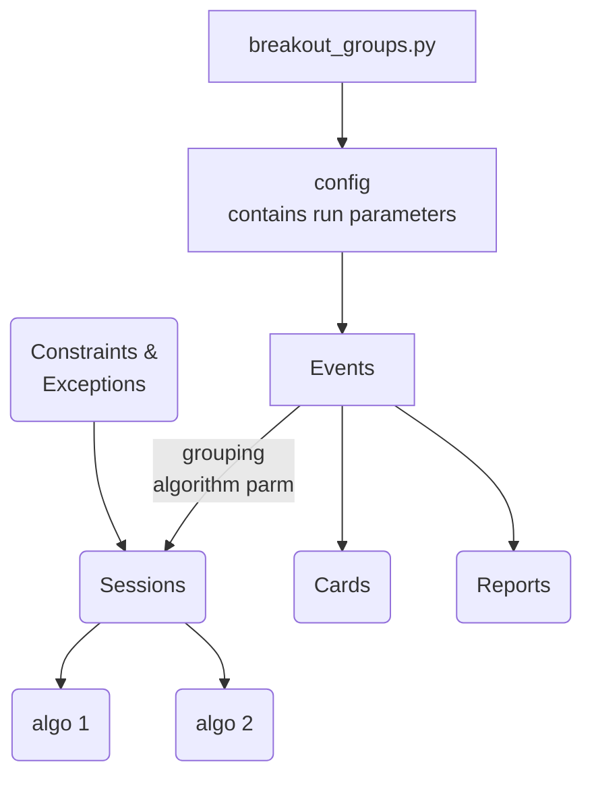
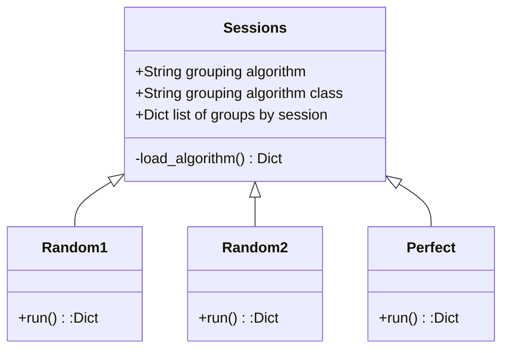

# Breakout Groups

## Overview

The breakout groups application is designed to assign attendees of an event into small groups.  There may be multiple sessions of small groups and the goal is to have as much interaction among the participants as possible, minimizing the number of times an attendee is in a group with the same other attendees.

The output is a 'card' for each attendee which identifies by session which group the attendee is assigned to.

Several reports are provided to analyze the effectiveness of the grouping alogrithm - is it achieving the interactions desired.  These reports also allow for comparision of different algorithms.

## System diagram


## Config

*`import src.config as cfg`*

This module should be imported as the first application module.  The first import reads the config file (`data/breakout_groups.ini`) and loads the runtime values.  If the ini file does not exist, it is created with the default values.

The config creates a namespace so variables can be referenced as cfg.var.  The variable is defined with its default in the namespace.  A config file, *`breakout_groups.ini`* is created on the first run if it does not exist.

Any changes to the ini file in the data folder are local and override the defaults.

If a new variable is added or if the variable name changes, then the version number should be updated.  This will rewrite the local ini file with the new variable.

## Sessions Class

### The Sessions

Two variables will be added to the config file:
```
[SYSTEM]
sys_group_algorithm = mmmmmm
sys_group_algorithn_class = cccccc
```
>where:
>* mmmmmm = the grouping algorithm module name without the .py located in src
>* cccccc = the class in the grouping algorithm module to be loaded

The Sessions Class will:
* dynamically call the sys_group_algorithm and load the class
* call the 'run' method of the class
* the module will return a dict of sessions in the format of
  ```
        {0:[[1,2,3],[4,5,6],....],
         1:[[6,3,8], [7,1,9],...],
        }
    one entry for each session.
  ```
* optionally: a dictionary of interactions will be returned.  An interaction is a dictionary
      with an entree for each attendee with a Counter.  The counter contains the number of interactions
      with other participants


### Algorithm Implementation

The sessions generation algorithm i implemented by having the sessions class load the grouping alogrithm module and run a predefined function (run) in the algorithm module.



See *`src/sessions_model.py`* for a sample of the session algorithm

**TODO**: Pass exceptions or constraints to the grouping algorithm to modify the grouping interactions.  To be defined.

### What is this repository for? ###

* Version
* [Learn Markdown](https://bitbucket.org/tutorials/markdowndemo)

## Getting Started ##

### Summary of set up
* run git clone
* from the root directory of the project run: python breakout_groups.py (this creates the breakout_groups.cfg in the data folder)
### Configuration
* in the data folder change the configurate file breakout_groups.py
* set title, sub-title, date and breakout session names
* set the number of attendees, number of groups, group_size
### How to run tests
* from the root folder run:  pytest -vs


### Contribution guidelines ###

* Writing tests
* Code review
* Other guidelines

### Who do I talk to? ###

* Repo owner or admin
* Other community or team contact
