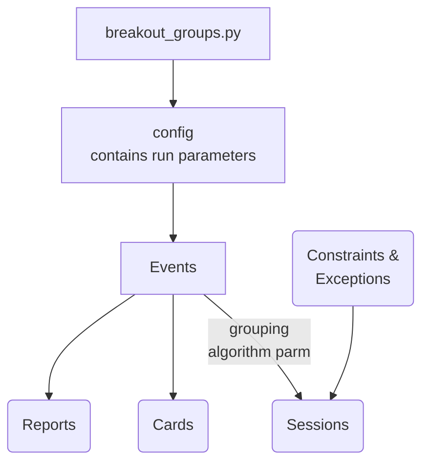
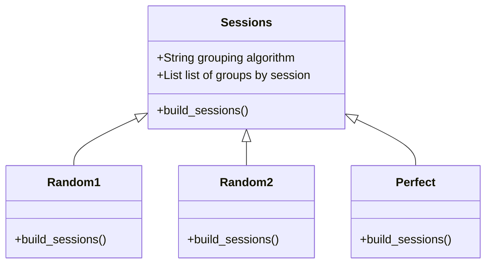

# Breakout Groups System Diagram

## Overview

The breakout groups application is designed to assign attendees of an event into small groups.  There may be multiple sessions of small groups and the goal is to have as much interaction among the participants as possible, minimizing the number of times an attendee is in a group with the same other attendees.

The output is a 'card' for each attendee which identifies by session which group the attendee is assigned to. 

Several reports are provided to analyze the effectiveness of the grouping alogrithm - is it achieving the interactions desired.  These reports also allow for comparision of different algorithms.

## System diagram

## Config

*import src.config as cfg*

This module should be imported as the first application module.  The first import reads the config file (data/breakout_groups.ini) and loads the runtime values.  If the ini file does not exist, it is created with the default values.

TODO: Add version number & grouping algrothrim parm.  When version changes, read ini file & rewrite with new information while perserving values set in parm.

## Sessions Class

The Sessions

* one approach is to use polymorphism to create different class with the same interface. 

The implementation of this concept can be done multiple ways.  Each approach assumes a parameter will be passed to identify the appropriate algorithm to use:

* creating an interface class and subclassing based on a parameter
* importing the appropriate module based on the parameter

TODO: Pass exceptions or constraints to the grouping algorithm to modify the grouping interactions.  To be defined.